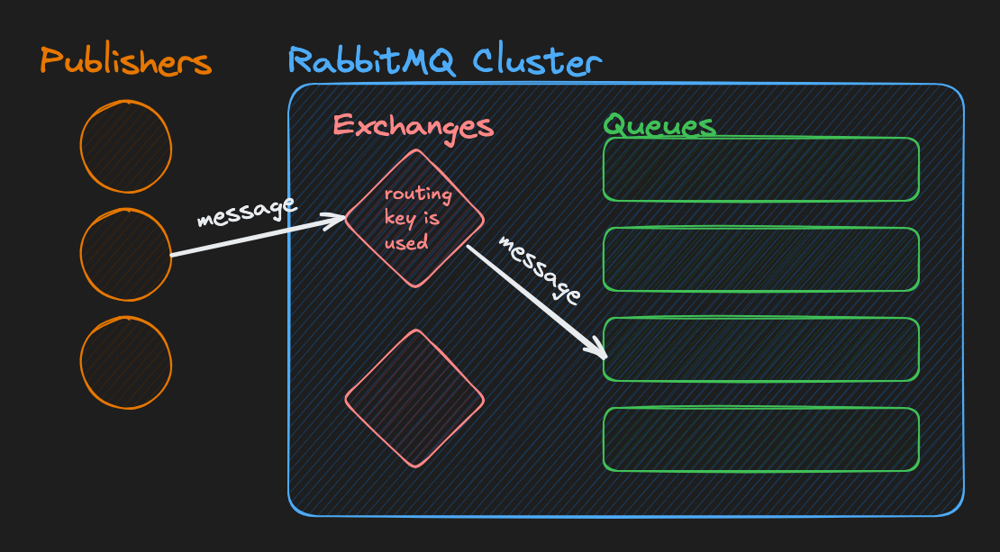
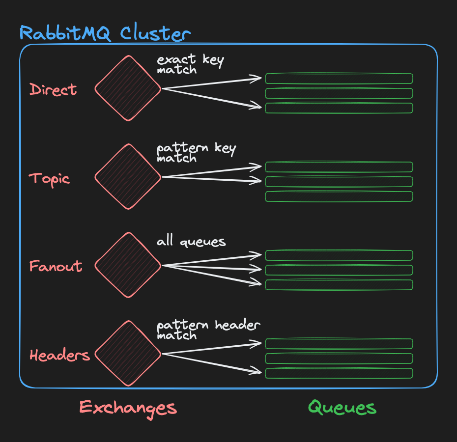
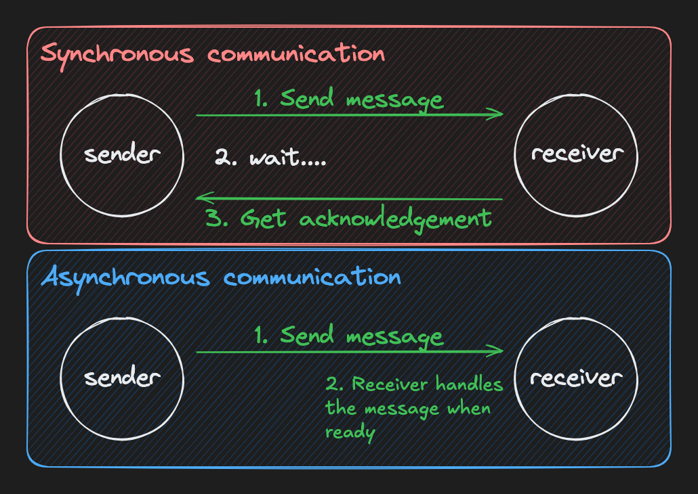
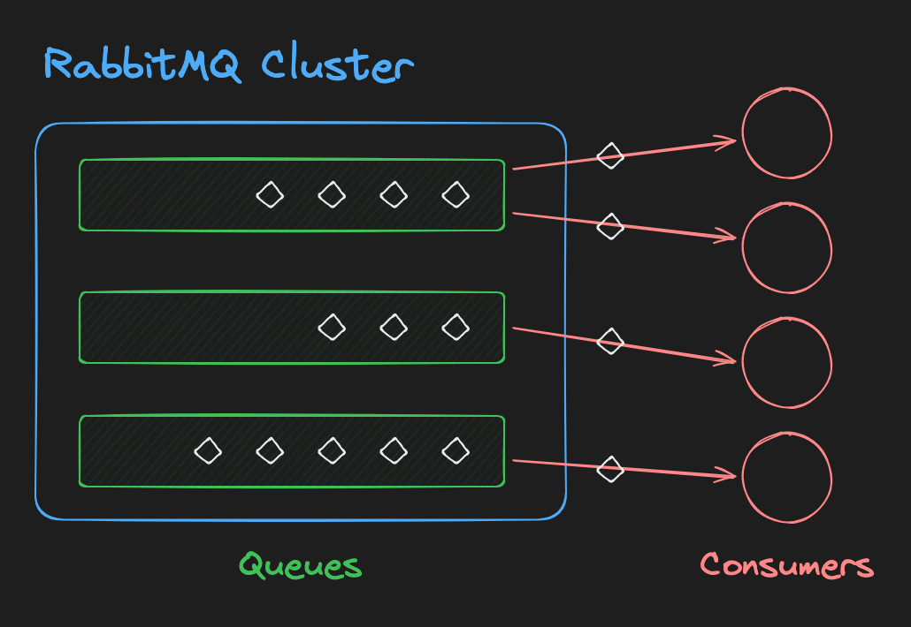
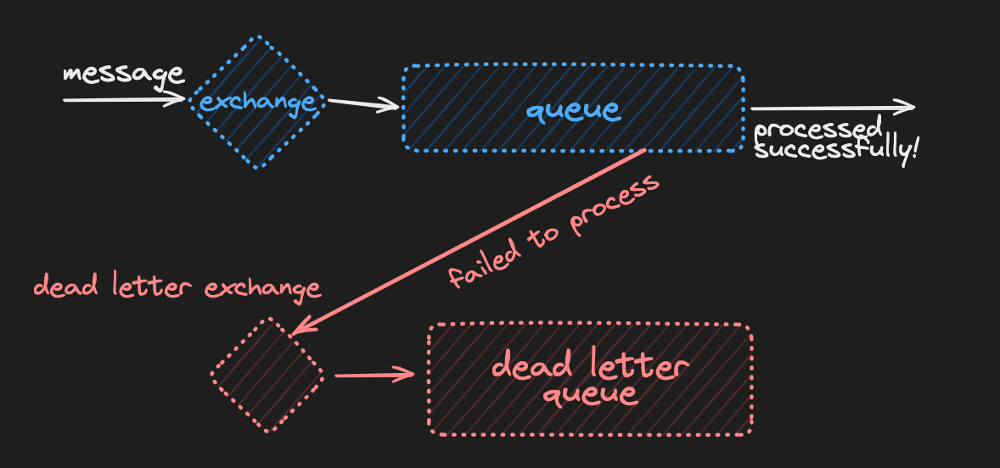
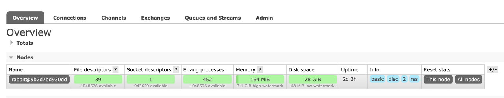
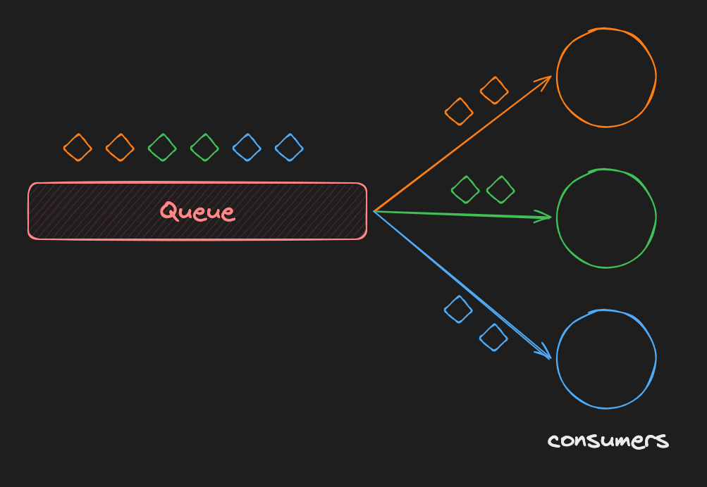

# RabbitMQ

RabbitMQ is the open source message broker that implement amqp protocol

It has 3 components

1. The RabbitMQ server: The message broker itself. It's a server you can run locally (or on a server in production) to send and receive messages.
2. Client library: We'll be programming in Go, so our code will use the AMQP library to interact with the RabbitMQ server.
3. Management UI: RabbitMQ comes with a management UI that you can use to monitor and manage your RabbitMQ server. It's a web-based UI that you can access in your browser.

Run this command in a terminal to start RabbitMQ:

```sh
docker run -it --rm --name rabbitmq -p 5672:5672 -p 15672:15672 rabbitmq:3.13-management
```

This will download and run the RabbitMQ server and ManagementUI until you kill it with Ctrl+C
The server itself is running on port 5672, but you won't interact with it in your browser, just through code. However, you can use the management UI in your browser. Open http://localhost:15672 and log in with the username guest and password guest.

# AMQP Protocol

- A communication protocol is just some rules that define how messages are sent, received, and understood.
- Just like we define how can is, then so we can communicate with the term cat to convey the four leg monster meaning

# MQTT and STOMP

- MQTT is designed for small IoT devices and as such is optimized to be lightweight and energy efficient.
- STOMP is designed for web applications and is designed to be simple and easy to use.
- AMQP is a sophisticated, feature-rich protocol that's great for complex routing, filtering, and delivery requirements.

Assignment:

Configure our RabbitMQ instance to support STOMP as well, just for fun. We'll need to create our own Dockerfile that installs the RabbitMQ STOMP plugin.

1. Create a file called Dockerfile with the following contents:

```docker
FROM rabbitmq:3.13-management
RUN rabbitmq-plugins enable rabbitmq_stomp
```

2, Build the image, and name it rabbitmq-stomp:

```sh
docker build -t rabbitmq-stomp .
```

3. If you have rabbit running, use ./rabbit.sh stop to stop it.
4. Take a look at the contents of rabbit.sh... you should see the line that's used to run a new RabbitMQ container with docker run. Copy that line into your terminal, but change it to do the following:
   1. Use the image you just built
   2. Expose the STOMP port: 61613
   3. Run the container.

Once it's running, test port 61613 with NetCat to make sure that it's open and that RabbitMQ is running the STOMP plugin:

```sh
nc -vz localhost 61613
```

You should get a "connection succeeded" message if all is well.

```sh
docker run -d --name rabbitmq_stomp -p 61613:61613 -p 15672:15672 rabbitmq-stomp
docker build -t rabbitmq-stomp .
```

# Exchanges and Queues

In RabbitMQ, an exchange is where publishers send messages, typically with a routing key.
The exchange takes the message, uses the routing key as a filter, and sends the message to any queues that are listening for that routing key.
Publishers don't know about queues at all. They just send messages to exchanges, sometimes with a routing key.


- Exchange: A routing agent that sends messages to queues.
- Binding: A link between an exchange and a queue that uses a routing key to decide which messages go to the queue.
- Queue: A buffer in the RabbitMQ server that holds messages until they are consumed.
- Channel: A virtual connection inside a connection that allows you to create queues, exchanges, and publish messages.
- Connection: A TCP connection to the RabbitMQ server.

Assingment:
Assignment
Let's update our server to publish pause/resume messages to an exchange on a specific routing key. The server can then communicate with all the various players of the game to let them know when the game is paused or resumed. We'll handle the queues and consumption of the messages later.

1. In cmd/server/main.go, after opening the RabbitMQ connection, create a new channel using the .Channel method on the connection.
2. Create a new package: internal/pubsub. This is where we'll put reusable code for interacting with RabbitMQ, that way we can use it in both the server and client.
3. Create an exported PublishJSON function in the internal/pubsub package. Here's its signature:

```go
func PublishJSON[T any](ch *amqp.Channel, exchange, key string, val T) error
```

4. In PublishJSON :
   1. Marshal the val to JSON bytes
   2. Use the channel's .PublishWithContext method to publish the message to the exchange with the routing key. Some configurations:
      1. Set ctx to context.Background()
      2. Set mandatory to false.
      3. Set immediate to false.
      4. In the amqp.Publishing struct, you only need to set two fields:
         1. ContentType to "application/json".
         2. Body to the JSON bytes.

5. Back in the server code, use the PublishJSON function to publish a message to the exchange!
   1. Use the channel you created.
   2. Use the internal/routing package's ExchangePerilDirect string for the exchange.
   3. Use the internal/routing package's PauseKey string for the routing key.
   4. Pass a PlayingState value from the internal/routing package with IsPaused set to true.
6. Make sure the RabbitMQ Docker container is running in the background, if it's not run ./rabbit.sh start.
7. Run your server with:

```sh
go run ./cmd/server
```

8. Watch the logs (./rabbit.sh logs) of the RabbitMQ server... you should see an error like this:
   no exchange 'peril_direct' in vhost '/'
9. Go to the RabbitMQ management UI at http://localhost:15672 and navigate to the "Exchanges" tab. Create a new exchange called peril_direct with the type direct.
10. Rerun the server. You should see the message get published without any errors in the RabbitMQ logs.
    While there are no hard errors, the message will be "unroutable" because there are no queues bound to the exchange yet, but we'll fix that later.

# Types of Exchanges

RabbitMQ supports several types of exchanges, each serving a different routing strategy.

In my experience, direct and topic are the most commonly useful in backend Pub/Sub architectures. I rarely have a use for sending all messages to all queues, or for routing based on the message headers.

Breakdown:

1. Direct: Messages are routed to the queues based on the message routing key exactly matching the binding key of the queue.
2. Topic: Messages are routed to queues based on wildcard matches between the routing key and the routing pattern specified in the binding.
3. Fanout: It routes messages to all of the queues bound to it, ignoring the routing key.
4. Headers: Routes based on header values instead of the routing key. It's similar to topic but uses message header attributes for routing.

# Create a Queue

- Queues are where the messages are stored after being routed through the exchange. Messages sit in a queue until they are consumed by a subscriber.

Durability

- Queues can be "durable" or "transient". Durable queues survive a RabbitMQ server restart, while transient queues do not.
- The metadata of a durable queue is stored on disk, while transient queues are only stored in memory.

Assignment:
Let's manually create a queue to capture the "pause" messages our server is sending.

1. Open the Management UI and navigate to the "Queues and Streams" tab. Click the "Add a new queue" dropdown at the bottom left.
2. Name the queue pause_test, because we're just going to use it temporarily to test our server's ability to publish messages.
3. Leave the durability as "Durable" and create the queue. If you screw it up, you can click on the queue, delete it, and try again.
4. Click on the queue, then go to the "Bindings" section. You'll be able to see that the queue is already bound to the default exchange. Add another binding to the peril_direct exchange.
   1. "From exchange": peril_direct
   2. "Routing key": Use the exact string of the PauseKey constant from the internal/routing package. This is a direct exchange, so the routing key must match exactly.
5. Click "Bind".
6. Restart your server to publish a new message to the exchange.
7. If everything worked, you should see a new "ready" message populate in the queue in the management UI. It's just sitting there patiently waiting to be consumed.
8. After selecting the queue, scroll down to the "Get messages" tab. Click "Get Message(s)" to see the message that was published by the server. The payload is the JSON representation of the PlayingState struct with the IsPaused field set to true, though the UI may display it as an encoded string.
9. The message should still be in the queue because "Nack message requeue true" will put the message back after showing it to you.

# Transient Queues

Let's update our code to automatically create and delete transient queues, rather than doing it manually. We'll create the queues that the client will use to receive the "pause" messages from the server.

## Durable and Transient Queue Types

Durable queues survive a RabbitMQ server restart, while transient queues do not. We can also set the auto-delete and exclusive properties of our queues:

- Exclusive: The queue can only be used by the connection that created it.
- Auto-delete: The queue will be automatically deleted when its last connection is closed.

For simplicity of our game, we'll make our transient and durable queues always have the same properties:

- "Durable" queues in our system will always be non-exclusive and non-auto-delete.
- "Transient" queues will always be exclusive and auto-delete.

## Assignment

1. Update the `cmd/client` package to connect to Rabbit, similar to the `cmd/server` package.
2. Use the `ClientWelcome()` function in `internal/gamelogic` to prompt the user for a username.
3. Declare and bind a transient queue by creating and using a new function in the `internal/pubsub` package. I called mine `DeclareAndBind` with this signature:

```go
func DeclareAndBind(
	conn *amqp.Connection,
	exchange,
	queueName,
	key string,
	queueType SimpleQueueType, // SimpleQueueType is an "enum" type I made to represent "durable" or "transient"
) (*amqp.Channel, amqp.Queue, error)
```

4. In `DeclareAndBind`:
   1. Create a new `.Channel()` on the connection.
   2. Declare a new queue using `.QueueDeclare()`:
      1. The `durable` parameter should only be true if `queueType` is durable.
      2. The `autoDelete` parameter should be true if `queueType` is transient.
      3. The `exclusive` parameter should be true if `queueType` is transient.
      4. The `noWait` parameter should be false.
      5. The `args` parameter should be nil.

   3. Bind the queue to the exchange using `.QueueBind()`.
   4. Return the channel and queue.

5. Back in the `cmd/client` package, use these parameters to call `DeclareAndBind`:
   1. `exchange`: `peril_direct` (this is a constant in the `internal/routing` package)
   2. `queueName`: `pause.username` where `username` is the user's input. The `pause` section of the name is the routing key constant in the `internal/routing` package and is joined by a `.`.
   3. `routingKey`: `pause` (this is a constant in the `internal/routing` package)
   4. `queueType`: transient

6. After declaring and binding the queue, the client should wait for a Ctrl+C signal to exit.
7. Run the client! Enter `suntzu` (all lowercase) as the username.
8. It will print out some nonsense about possible commands, but you can ignore that. You can't run them yet because we haven't implemented them.
9. Check the RabbitMQ management UI to see if the queue was created and bound to the exchange.
10. Close the client. If all goes well, the queue should automatically be deleted after a few seconds.
11. Run the client as `suntzu` again, making sure the queue is recreated.

# Decoupling

- One of the big advantages of a Pub/Sub architecture over a point-to-point messaging system is decoupling.
- Our server publishes the "Hey, I'm pausing the game" message _once_ to the broker, and anyone who cares can get a copy of the message in their own queue, all without the server knowing or caring who's listening.

## Assignment

First, let's update the server so that it can interactively pause and resume the game.

1. Run the `PrintServerHelp` function in `internal/gamelogic` as the server starts up so that you can see the commands the user of the REPL can use.
2. Start an infinite loop.
3. At the beginning of the loop, use the `GetInput` function in `internal/gamelogic` to wait for a slice of input "words" from the user. If the slice is empty, continue to the next iteration of the loop.
4. Check the first word:
   1. If it's `"pause"`, log to the console that you're sending a pause message, and publish the pause message as you were doing before.
   2. If it's `"resume"`, log to the console that you're sending a resume message, and publish the resume message as you were doing before. The only difference is that the `IsPaused` field should be set to `false`.
   3. If it's `"quit"`, log to the console that you're exiting, and break out of the loop.
   4. If it's anything else, log to the console that you don't understand the command.
5. Test the app:
   1. Start 3 clients, each in their own terminal. Use the usernames `washington`, `napoleon`, and `churchill`.
   2. Run the server again to pause the game.
   3. You should see 3 queues created in the RabbitMQ management UI, each with its own copy of the "pause" message.

# Client REPL

Let's update the client to support its REPL commands (or at least an empty shell of them).

## Assignment

1. In the `cmd/client` application, after declaring and binding the pause queue, use the `NewGameState` function in `internal/gamelogic` to create a new game state.
2. Add a REPL loop similar to what you did in the `cmd/server` application. Here's what each command should do:
   1. The `spawn` command allows a player to add a new unit to the map under their control. Use the `gamestate.CommandSpawn` method and pass in the "words" from the `GetInput` command.
      - Possible unit types are: `infantry`, `cavalry`, `artillery`
      - Possible locations are: `americas`, `europe`, `africa`, `asia`, `antarctica`, `australia`
      - Example usage: `spawn europe infantry`
      - After spawning a unit, you should see its ID printed to the console.

   2. The `move` command allows a player to move their units to a new location. It accepts two arguments: the destination, and the ID of the unit. Call the `gamestate.CommandMove` method and pass in all with "words" from the `GetInput` command. If the move is successful, print a message indicating that it worked.
      - Example usage: `move europe 1`

   3. The `status` command uses the `gamestate.CommandStatus` method to print the current status of the player's game state.
   4. The `help` command uses the `gamelogic.PrintClientHelp` function to print a list of available commands.
   5. For now, the `spam` command just prints a message that says `"Spamming not allowed yet!"`
   6. The `quit` command uses the `gamelogic.PrintQuit` function to print a message, then exit the REPL.
   7. If any other command is entered, print an error message and continue the loop.

3. Test the Client REPL
   1. Start up a client REPL and test each command.
   2. Make sure that you can spawn units of all the different types and move them around the map.

# Sync vs Async



# Topic Exchange

As we talked about before, topic-type exchanges are the most flexible and powerful type of exchange.

## Assignment

1. Open the RabbitMQ management UI and click on the exchanges tab.
2. Create a new exchange with type topic, and name it peril_topic.

# Durable

Durable queues survive a server restart, and in our case, we'll also make sure they:

1. Are not deleted automatically when they are no longer in use
2. Are not exclusive (multiple consumers can share the same queue)

## Assignment

Update the cmd/server application to declare and bind a queue to the new peril_topic exchange.

- It should be a durable queue named game_logs.
- The routing key should be game_logs.\*. We'll go into detail on the routing key later.

# Consumers

So as of right now, we have the following setup:

1. A publisher publishes a message
2. The message arrives in an exchange
3. The message is routed to queue(s)
4. ???
5. Profit

In all seriousness, **nothing happens** after the message arrives in the queue!

This is where consumers come in. Consumers are programs (like our "client" program) that connect to queues and pull the messages out of them.


## Assignment

Let's configure our client consumers to process the "pause messages" and update their local game state.

1. In your `internal/pubsub` package, create a new function called `SubscribeJSON`, here's my function signature:

```go
func SubscribeJSON[T any](
    conn *amqp.Connection,
    exchange,
    queueName,
    key string,
    queueType SimpleQueueType, // an enum to represent "durable" or "transient"
    handler func(T),
) error
```

2. In `SubscribeJSON`:
   1. Call `DeclareAndBind` to make sure that the given queue exists and is bound to the exchange
   2. Get a new [chan](https://gobyexample.com/channels) of [amqp.Delivery](https://pkg.go.dev/github.com/rabbitmq/amqp091-go#Delivery) structs by using the [`channel.Consume`](https://pkg.go.dev/github.com/rabbitmq/amqp091-go#Channel.Consume) method.
      1. Use an empty string for the consumer name so that it will be auto-generated
      2. Set all other parameters to false/nil

   3. Start a goroutine that [ranges](https://tour.golang.org/moretypes/16) over the channel of deliveries, and for each message:
      1. Unmarshal the body (raw bytes) of each message delivery into the (generic) `T` type.
      2. Call the given `handler` function with the unmarshaled message
      3. Acknowledge the message with [`delivery.Ack(false)`](https://pkg.go.dev/github.com/rabbitmq/amqp091-go#Delivery.Ack) to remove it from the queue

3. Create a new function called `handlerPause` in the `cmd/client` application package. It accepts a game state struct and returns a new handler function that accepts a `routing.PlayingState` struct. This will be the `handler` we pass into `SubscribeJSON` that will be called each time a new message is consumed. Here's my signature:

```go
func handlerPause(gs *gamelogic.GameState) func(routing.PlayingState)
```

1. In the handler function that `handlerPause` returns:
   1. Use `defer fmt.Print("> ")` to display a new prompt (`> `) when the function exits.
   2. Use the game state's `HandlePause` method to pause the game for the client.

2. In the `cmd/client` package's `main` function, after creating the game state, replace your previous `DeclareAndBind` call with `pubsub.SubscribeJSON`. Use the following parameters:
   1. The connection
   2. The direct exchange (constant can be found in `internal/routing`)
   3. A queue named `pause.username` where `username` is the username of the player
   4. The routing key `pause` (constant can be found in `internal/routing`)
   5. Transient queue type
   6. The new handler we just created.

3. Test the New Code
   1. Start an instance of the server and the client in separate terminals. Use `washington` as the username for the client.
   2. Spawn a unit using the client: `spawn europe infantry`
   3. Pause the game using the server. You should see the client detect (consume) the pause message
   4. Try to move a unit, the client should not allow it because the game is paused
   5. Resume the game using the server. You should see the client detect (consume) the resume message
   6. Try to move a unit, the client should allow it

# Multi Consumers

A queue can have 0, 1, or many consumers.


If a queue has no consumers, messages will accumulate in the queue and never be processed.
If a queue has one consumer, that consumer will process all messages in the queue (assuming it can keep up).
If a queue has many consumers, messages will be distributed between them in a round-robin fashion (unless you set a priority).
Multiple queues each receive a copy of a message, but multiple consumers on one queue split the messages so each message is handled once.

The exclusive flag can be used to tell the RabbitMQ server to only allow one consumer to connect to the queue at a time. I've found that often my pub/sub needs fall into one of two categories:

Process an event once-per-server-instance (good for ephemeral, exclusive queues with one consumer)
Process an event once, period (good for durable, non-exclusive queues with many consumers)

# Routing Patterns

Routing keys are one of the most powerful features of RabbitMQ. They allow the message broker to flexibly route messages to queues based on pattern matching, rather than exact matches.

## Words

[Routing keys](https://www.rabbitmq.com/tutorials/tutorial-five-python#topic-exchange) in RabbitMQ are made up of words separated by dots. For example, the routing key `user.created` is made up of two words: `user` and `created`. The routing key `peril.game.won` is made up of three words: `peril`, `game`, and `won`.

## Wildcards

RabbitMQ supports two types of wildcards in routing keys:

- `*` (star) substitutes for exactly one word
- `#` (hash) substitutes for zero or more words

## Examples

A queue bound to the key `peril.#` will pick up messages published to routing keys:

- `peril.game.won`
- `peril.game.lost`
- `peril.player`
- `peril`

It will not match:

- `game.won`
- `perilgame.won`

A queue bound to the key `peril.*.won` will pick up messages published to routing keys:

- `peril.game.won`
- `peril.player.won`

It will not match:

- `peril.game.lost`
- `peril.won`

## Assignment

Whenever a player (client) uses the `move` command in our "Peril" game, we want to broadcast the move to all other connected players. We'll publish the message to the `army_moves.username` routing key, where `username` is the name of the player who made the move.

Each client needs to bind a queue to the exchange using the routing key `army_moves.*` so that they get all the moves from other players.

1. Each game client should subscribe to moves from other players before starting its REPL.
   1. Bind to the `army_moves.*` routing key.
   2. Use `army_moves.username` as the queue name, where `username` is the name of the player.
   3. Use the `peril_topic` exchange.
   4. Use a transient queue.
   5. The handler for new messages should use the `GameState`'s `HandleMove` method and then print a new `>` prompt for the user.

2. The `move` command in the REPL should now publish a move.
   1. Publish the move to the `army_moves.username` routing key, where `username` is the name of the player.
   2. Use the `peril_topic` exchange.
   3. Log a message to the console stating that the move was published successfully.

Test the changes by running 2 or 3 clients. Have one of the clients spawn a couple of units:

```text
spawn americas infantry
spawn antarctica cavalry
```

Then move the units:

```text
move asia 1 2
```

All clients, _including the one who made the move_, should log a message that they successfully detected the move.

# Naming

Technically, you can name your exchanges, queues, and routing keys whatever you want, but it's critically important to choose good names. Not only will it make your system easier to understand, but it can also make it more flexible and powerful.

## Exchange Naming

It's common for one "system" to all use the same exchange. Similar to how you might have a single "database" within a Postgres instance, you might just have a single "exchange" within a RabbitMQ instance. For example, I worked on a system that managed hundreds of thousands of social media messages per hour. We had a single exchange called `social_posts`, and it was the only exchange we used.

## Queue Naming

When I'm working with a direct `key -> queue` relationship, I'll often name the queue the same as the key, but add a word to describe the intended consumer. For example, if I have a routing key `user.created`, I might create a queue for my "email notifier" service called `user.created.email_notifier`.

If I have a queue that consumes _all_ user events, I might name it `user.all.billing_service`.

If I have temporary queues, I might append a UUID to the queue name to ensure uniqueness. For example, maybe I have web servers that scale up and down based on traffic, and each server needs a copy of "comment created" events. I might name each server's queue one of:

- `comment.created.bb7a488b-b4e9-4b16-a697-51c20a09b87b`
- `comment.created.8d0a9d3e-5244-460b-bacc-80ae2b802677`
- `comment.created.6814c13f-c33b-4ff7-a4f8-98c718fea980`
- ...

I'll often use auto-generated queue names like this with transient, auto-delete, and exclusive properties so they can be created and destroyed as the system restarts and scales.

## Routing Key Naming

This is the one that you _really_ want to get right. Not only do you want the routing key names to be descriptive, but you also want them to be flexible for potential wildcard matching. I've found that often a `noun.verb` pattern works well. For example:

- `user.created`
- `user.updated`
- `comment.created`
- `comment.deleted`
- etc.

# Dead Letter

In a point-to-point system, the sender and receiver are tightly coupled. The sender immediately knows if the message was successfully delivered to the receiver. For example, with HTTP requests, we get simple [response codes](https://developer.mozilla.org/en-US/docs/Web/HTTP/Status) like:

- `200 OK`
- `404 Not Found`
- `500 Internal Server Error`

In an asynchronous system like RabbitMQ, the sender and receiver are decoupled. The sender doesn't need to know if the message was successfully delivered to the receiver. That has benefits, like simplicity and performance, but it also means that the chance of bugs increases.

## Dead Letter Exchanges and Queues

To address this, it's common in PubSub systems to aggregate messages that fail to be processed into a [dead letter queue](https://www.rabbitmq.com/dlx.html). Queues can be configured to send messages that fail to be processed to a dead letter exchange, which then routes the message to a dead letter queue.



## Assignment

We're going to send _all_ failed messages in the Peril system to a single dead letter exchange/queue. It will act as a log. This queue won't have any consumers, we'll just let the messages pile up so we can inspect them manually using the RabbitMQ management UI.

1. Using the UI, create a new exchange called `peril_dlx` of type [fanout](https://www.rabbitmq.com/tutorials/amqp-concepts.html#exchange-fanout). Use the default settings.
2. Fanout is a good choice because we want _all_ failed messages sent to the exchange to be routed to the queue, without needing to worry about routing keys.
3. Using the UI, create a new queue called `peril_dlq`.
4. Go to the queue's page and bind the queue to the `peril_dlx` exchange with no routing key. Leave the default settings.

# Ack and Nack

So how does a consumer tell the message broker that an individual message succeeded or failed to be processed? When a consumer receives a message, it must [acknowledge](https://www.rabbitmq.com/confirms.html) it.

If the subscriber crashes or fails to process the message, the message broker can just re-queue the message to be processed again, or discard it (perhaps to a dead-letter queue).

"Ack" is short for "acknowledge", and "Nack" is short for "negative acknowledge". There are really 3 options for acknowledging a message:

1. **Acknowledge**: Processed successfully.
2. **Nack** and requeue: Not processed successfully, but should be requeued on the same queue to be processed again (retry).
3. **Nack** and discard: Not processed successfully, and should be discarded (to a dead-letter queue if configured or just deleted entirely).

## Assignment

1. Update your `internal/pubsub.SubscribeJSON` function's `handler` parameter to return an "acktype" instead of nothing.
   1. An "acktype" should be one of:
      - `Ack`
      - `NackRequeue`
      - `NackDiscard`

   2. Depending on the returned "acktype", the goroutine that calls the handler should either call:
      - `Ack`: [`msg.Ack(false)`](https://pkg.go.dev/github.com/rabbitmq/amqp091-go#Delivery.Ack)
      - `NackRequeue`: [`msg.Nack(false, true)`](https://pkg.go.dev/github.com/rabbitmq/amqp091-go#Delivery.Nack)
      - `NackDiscard`: [`msg.Nack(false, false)`](https://pkg.go.dev/github.com/rabbitmq/amqp091-go#Delivery.Nack)

2. For testing/debugging purposes, add a log statement alongside each Ack/Nack call to indicate which action occurred.
3. Update your client's "move" and "pause" handlers to return an "acktype".
   1. The "pause" handler should always Ack.
   2. The "move" handler should only "Ack" if:
      - The move outcome was "safe"
      - Or, the move outcome was "make war"

   3. The "move" handler should "NackDiscard" if:
      - The move outcome was "same player"
      - Or, the move outcome was anything else

Test the changes by running 2 clients: `washington` and `napoleon`. Have `washington` spawn a couple of units:

```text
spawn americas artillery
```

Have `napoleon` spawn a unit:

```text
spawn europe cavalry
```

Then have `washington` move a unit into `napoleon`'s territory:

```text
move europe 1
```

Napoleon's client should "Ack" the message, and Washington's client should "NackDiscard" the message. Make sure your logs reflect that. You can move on when you're satisfied with the results.

> You might notice that nothing went to the dead-letter queue. That's because we haven't configured it yet, and that's okay.

# Dead Letter Queue

We have a dead letter exchange and a dead letter queue, we just haven't configured any of our "normal" queues to send failed messages to the dead letter exchange yet.

## Assignment

1. In your `internal/pubsub` package, update your `DeclareAndBind` function. It should pass in an [amqp.Table](https://pkg.go.dev/github.com/rabbitmq/amqp091-go#Table) to the `QueueDeclare` function that includes a `x-dead-letter-exchange` key. The value should be the name of your dead letter exchange. This will tell RabbitMQ to send failed messages to the dead letter exchange.
2. Stop your clients and restart them. This should delete their auto-delete queues and recreate them with the new dead letter exchange configuration.
3. Delete the durable `game_logs` queue manually using the UI. Durable queues survive restarts, so redeclaring one with different arguments shows an `inequivalent arg` error.
4. Run the same test as before by creating 2 clients: `washington` and `napoleon`.
   1. Have `washington` spawn a couple of units: `spawn americas artillery`
   2. Have `napoleon` spawn a unit: `spawn europe cavalry`
   3. Have `washington` move a unit into `napoleon`'s territory: `move europe 1`

Napoleon's client should "Ack" the message, and Washington's client should "NackDiscard" the message. This time, check the queue in the RabbitMQ management UI. You should see the failed message in the dead letter queue.

> You can check the "Get messages" section of the queue's page. Get the latest message with "Nack Requeue" so you can see the raw message data.

# Exact Delivery

Delivering messages is hard. When you architect a system, you need to decide what guarantees to make. The three main types are:

1. **At-least-once delivery**: If the message broker isn't sure the consumer received the message, it's retried.
2. **At-most-once delivery**: If the message broker isn't sure the consumer received the message, it's discarded.
3. **Exactly-once delivery**: The message is guaranteed to be delivered once and only once.

| Type          | Complexity | Efficiency | Reliability |
| ------------- | ---------- | ---------- | ----------- |
| At-least-once | Medium     | Medium     | Medium      |
| At-most-once  | Low        | High       | Low         |
| Exactly-once  | High       | Low        | High        |

## At-least-once

In RabbitMQ, at-least-once delivery is the default. If a consumer fails to process a message, the message broker will just re-queue the message to be processed again. That means that you typically want to write your consumer code in such a way that it can process the same message multiple times without causing problems.

For example, if you have a message that says "Falkor created an account", and your consumer is responsible for sending a verification SMS, you can simply have your consumer check if it already sent an SMS to Falkor in the last 3 minutes before sending another one. That way, even if the message is processed multiple times, only one SMS is sent.

_NackRequeue is the default behavior in Rabbit, and it's an example of at-least-once delivery._

## At-most-once

At-most-once delivery makes more sense when you're dealing with messages that, frankly, aren't mission-critical. For example, instead of a message that represents a user account, maybe it's just a debug log. At-most-once delivery is more efficient from a performance perspective because it doesn't require the message broker to keep track of which messages have been processed, but obviously, it's less reliable.

## Exactly-once

Exactly-once delivery is [nearly impossible](https://exactly-once.github.io/posts/exactly-once-delivery/). That said, there are certainly ways to approximate it to the point of it being reliable from a practical perspective. However, of the three options, exactly-once delivery is the most difficult to implement and the most inefficient (slow).

**At-least-once delivery is generally a good "default" choice for most systems.**

# Nack Requeue

So we've seen that `NackDiscard` removes a message from the primary queue, but what if we want to retry the message? As a general rule, you want to split your consumer's errors into two classes:

- **Logical errors**: Unlikely to be resolved with a retry. For example, a message is malformed JSON, or the ID of a user doesn't exist in the database.
- **Transient errors**: Likely to be resolved with a retry. For example, a network timeout, or a database connection error.

If you `NackRequeue` a message, it will be requeued to the primary queue to be processed again. This can be _very bad_ if the error isn't transient as it will just be reprocessed over and over forever, blocking other messages and incurring large processing costs.

I call this "Requeue Hell", and I've been forged in its fires.

**Only `NackRequeue` messages if you're confident a retry will resolve the issue!**

## Assignment

Let's hook up the "war" logic of Peril!

1. Update the "move" handler (and its registration in `main.go`) to accept an AMQP channel. When it detects `MoveOutcomeMakeWar`, it should:
   1. Publish a message to the "topic" exchange with the routing key `$WARPREFIX.$USERNAME`.
      1. `routing.WarRecognitionsPrefix` contains the `$WARPREFIX` constant
      2. The `$USERNAME` should be the name of the player consuming the move.
      3. Use this struct as the data to be published:

         ```go
         gamelogic.RecognitionOfWar{
            Attacker: move.Player,
            Defender: gs.GetPlayerSnap(),
         }
         ```

   2. NackRequeue the message... Might seem crazy, but it will be fun.

2. Create a new handler that consumes _all_ the war messages that the "move" handler publishes, no matter the username in the routing key. It should:
   1. `defer fmt.Print("> ")` to ensure a new prompt is printed after the handler is done.
   2. Call the gamestate's `HandleWar` method with the message's body.
   3. If the outcome is `gamelogic.WarOutcomeNotInvolved`: NackRequeue the message so another client can try to consume it.
   4. If the outcome is `gamelogic.WarOutcomeNoUnits`: NackDiscard the message.
   5. If the outcome is `gamelogic.WarOutcomeOpponentWon`: Ack the message.
   6. If the outcome is `gamelogic.WarOutcomeYouWon`: Ack the message.
   7. If the outcome is `gamelogic.WarOutcomeDraw`: Ack the message.
   8. If it's anything else, print an error and NackDiscard the message.

3. Use a durable queue with the war handler. The queue name should just be `war`. All clients will **share** this queue. Whenever war is declared, only one client will consume the message.
4. Test the changes.
   1. Open the `war` queue in your RabbitMQ management UI.
   2. Have `washington` spawn a unit: `spawn americas infantry`
   3. Have `napoleon` spawn a unit: `spawn europe cavalry`
   4. Have `washington` move into `napoleon`'s territory: `move europe 1`

Watch as the queue freaks the hell out. You should see thousands of messages being requeued and processed over and over. It's a beautifully terrifying sight.

# Nack Requeue Fix

Well, we don't want to be stuck in requeue hell. Let's fix that.

## Assignment

1. Update the "move" handler.
   1. If publishing the war declaration fails, "NackRequeue" the message.
   2. Otherwise, "Ack" the message.

It makes sense to requeue on a network failure, but we shouldn't requeue if the message was successfully processed. Additionally, I want to call attention to how the "war" handler works: notice that if the outcome is "not involved" the client requeues the message. That's so that another client can pick it up and try to process it. The event can only be processed successfully by a client involved in the war.

It's a bit janky, but it demonstrates how requeueing works, so here we are.

2. Test the Changes
   1. Open the `war` queue in your rabbitmq management UI.
   2. Have `washington` spawn a unit: `spawn americas infantry`
   3. Have `napoleon` spawn a unit: `spawn europe cavalry`
   4. Have `washington` move into `napoleon`'s territory: `move europe 1`

You should see a message indicating that Washington lost the war, and importantly, no more requeue hell.

If even after making these changes you seem to be stuck with a stream of messages, you can safely delete or purge the `war` queue via the management UI.

# Game Logs

In the Peril game, occasionally we want to "log" a game event. Those logs should go to a central location where they can be inspected later. It's common in large backend systems to print logs to [stdout](https://en.wikipedia.org/wiki/Standard_streams#Standard_output_%28stdout%29) or [stderr](https://en.wikipedia.org/wiki/Standard_streams#Standard_error_%28stderr%29), but to also send logs to a central logging system or database.

## Assignment

Whenever "war" events happen, we want to log them. For now, let's just add the functionality to publish them, and we'll let the messages pile up in the logs queue.

1. Add a `PublishGob` function to the `internal/pubsub` package.
   1. It should be similar to the `PublishJSON` function, but encode to [gob](https://pkg.go.dev/encoding/gob)
   2. Set the `ContentType` option to `application/gob`

2. Update the war handler function in the client to publish game logs.
   1. Capture the `winner` and `loser` return values from the `GameState`'s `HandleWar` method and use them to create the log message.
      1. If the outcome is that the opponent won, the message should say `"{winner} won a war against {loser}"`.
      2. If the outcome is that the player won, the message should also say `"{winner} won a war against {loser}"`.
      3. If the outcome is a draw, the message should say `"A war between {winner} and {loser} resulted in a draw"`.

   2. Create a reusable function to publish a `GameLog` struct:
      1. The topic exchange.
      2. The `GameLogSlug.username` routing key, where `username` is the name of the player who initiated the war, and `GameLogSlug` is a constant in the `routing` package.
      3. The `GameLog` struct should be serialized using the `PublishGob` function. Fill all the fields in.

   3. If a publishing fails, `NackRequeue`, otherwise `Ack`.

3. Test the code.
   1. Spin up two clients and a server. Make sure the `game_logs` queue exists.
   2. Have one client spawn a unit: `spawn americas infantry`
   3. Have the other client spawn a unit: `spawn europe cavalry`
   4. Have the first client declare war by moving a unit into the other client's territory: `move europe 1`
   5. Repeat with different matchups to trigger **each war outcome** (you win, opponent wins, draw). You need at least **three logs** in the `game_logs` queue before submitting.

You should be able to verify in the RabbitMQ management UI that a log was published to the `game_logs` queue.

If you get a `PRECONDITION_FAILED` error when starting your server, you may need to delete the existing `game_logs` queue and restart your server. You cannot redeclare a queue with different arguments.

# Consume Logs

Now let's consume the logs and save them to disk.

## Assignment

1. Create a [.gitignore](https://git-scm.com/docs/gitignore) file if you don't already have one and ignore all files ending in `.log`:

```gitignore
*.log
```

2. Add a `SubscribeGob` function to the `internal/pubsub` package. It should be similar to the `SubscribeJSON` function, but decode from [gob](https://pkg.go.dev/encoding/gob) instead of JSON.

I used generics to create a helper function to share duplicate code between `SubscribeJSON` and `SubscribeGob`. If you're curious this was the function signature of the helper:

```go
func subscribe[T any](
    conn *amqp.Connection,
    exchange,
    queueName,
    key string,
    simpleQueueType SimpleQueueType,
    handler func(T) Acktype,
    unmarshaller func([]byte) (T, error),
) error
```

3. Update the server to `SubscribeGob` to the `game_logs` queue instead of just declaring it. Use a wildcard in the routing key to make sure you capture logs from all clients, no matter the username. The handler should:
   1. Defer printing a new prompt to the console.
   2. Use the `gamelogic.WriteLog` function to write the log to disk.

4. Test the code.
   - Because your queue has some logs in it, you should see them get consumed as soon as you restart the server.
   - Make sure that the `game.log` file contains the logs you expect.
   - Ensure all the messages from the `game_logs` queue are consumed using the Rabbit UI.

# Schema

We've serialized structs to [JSON](https://en.wikipedia.org/wiki/JSON) and [Gob](https://pkg.go.dev/encoding/gob), but there are many other possible choices like [protocol buffers](https://developers.google.com/protocol-buffers) or [Avro](https://avro.apache.org/).

While choosing which serialization format to use is important, it's also important to be careful about the shape or "schema" of the data you're serializing. As a general rule, if you make breaking changes to a schema, make sure you handle backward compatibility.

## Updating the Schema

Let's say we have a `User` struct that we send around in our Pub/Sub system:

```go
type User struct {
    ID int
    Name string
}
```

It's usually okay to just add and remove fields willy-nilly:

```go
type User struct {
    ID int
    Name string
    Email string
}
// or
type User struct {
    ID int
}
```

However, if you _change_ a field, you need to be careful. Say we want to make this update:

```go
type User struct {
    ID string // change to string
    Name string
}
```

If there are old messages in a queue with the `int` IDs and we push this change, our new consumers will fail to decode the old messages over and over, resulting in a lot of errors and discarded messages (or retry loops). I have a simple rule:

_If you make a breaking change to a schema, use a new routing-key/queue._ That way, the old consumers can polish off all the old messages, and the new consumers can start fresh with the new schema.

## Note

In some languages, like JavaScript, you also have to be careful about removing fields because it can result in `undefined` errors if the client isn't coded in a robust way. In Go, it's usually safer because it defaults to the zero value.

# Nodes and Clusters

RabbitMQ and most other message brokers are [distributed systems](https://en.wikipedia.org/wiki/Distributed_computing). Our local RabbitMQ server is just a single node, but in production, you'd likely have an entire cluster of nodes. Some advantages of a large cluster include:

1. **High Availability**: If one node goes down, other nodes can take over.
2. **Scalability**: You're not constrained by the resources of a single machine.
3. **Redundancy**: If one node goes down, the messages aren't lost.

## Resources

1. **CPU**: Faster nodes (more [cores](https://en.wikipedia.org/wiki/Multi-core_processor), higher [clock speed](https://en.wikipedia.org/wiki/Clock_rate)) and more nodes can both help.
2. **Memory**: More [RAM](https://en.wikipedia.org/wiki/Random-access_memory) per node and more nodes can both help.
3. **Disk**: More disk space per node and more nodes can both help.
4. **Network Bandwidth**: In a cloud setting, bandwidth is usually provisioned in proportion to a node's size.

I've found that using a cluster of 3 nodes is a solid starting point for most production applications, even if you're processing thousands of messages per second. I've also found that when you find your nodes starting to hit limits on CPU, RAM, or Disk, it's generally better to scale vertically first (more powerful nodes) before you go crazy horizontally (larger number of nodes).

More nodes mean more resources, but it also means more management overhead and complexity.

## A Story

I worked on a system that processed tens of thousands of messages per second on a single Rabbit cluster. When I started we had 3 relatively small nodes (2-core CPU, 8GB RAM, 100GB disk). First, we started to run out of CPU and RAM, so we scaled vertically. We eventually were using a 32-core CPU, and 128GB RAM. From there, we moved to 5 nodes instead of 3 and were able to handle the load well at each step.

## How Do You Know?

The overview tab in the RabbitMQ management console is the best place to start. It will show you high-level stats about the resource usage of your cluster.



# Backpressure

Backpressure is a common problem in Pub/Sub systems. It happens when messages are being published to a queue faster than they can be consumed. This leads to a growing queue size, which can eventually cause the system to run out of memory or disk space.

## Assignment

Let's add a feature to spam absurd amounts of game logs... for science. We'll use this feature to demonstrate backpressure.

1. In the `cmd/client` package, in the `main` function, update the section of code that handles the `spam` command. It should now:
   1. Ensure that a second "word" was provided in the command. E.g. `spam 10` or `spam 1000`. Convert that word into an integer.
   2. Do the following `n` times, where `n` is the integer from the command:
      1. Use `gamelogic.GetMaliciousLog` to get a malicious log message.
      2. Publish the log message (a struct) to Rabbit. Use the following parameters:
         1. Exchange: `peril_topic`
         2. Key: `game_logs.username`, where `username` is the username of the player

Because our `game_logs` queue is listening for messages with the routing key `game_logs.*`, the server will receive messages from all players.

2. Test the new code.
   1. Start a server and a client. Open the web UI to the `game_logs` queue screen.
   2. Use the client to spam 25 log messages.
   3. Notice how in the web UI you should see a spike in queued messages. Notice that the server can only process one log per second (due to the `time.Sleep` call in `WriteLog`), so after 25 seconds, you should see the queue empty out.
   4. Publish another 1,000 logs.
   5. Again, you'll see a huge spike, but this time it's going to take too long to wait for...

**Stop the server**, then **run and submit** the CLI tests **while the queue has at least 500 messages!**

In the next lesson, we'll empty the queue.

## Troubleshooting

If `messages_ready` is set to 0, try the following:

- Restart the `rabbitmq` container. Make sure the `peril_direct` and `peril_topic` exchanges are there (they should be if you use `rabbit.sh`) and restart the server to create the `game_logs` queue.

# Healthy Queues Are Empty

Your `game_logs` queue should be quite full still. It's an unhealthy queue because it grows faster than it can be consumed. This is dangerous because it can lead to the system running out of memory or disk space. **If Rabbit goes down, your whole system goes down with it.**

> A healthy queue is an empty queue.

Most of the time a healthy cluster, even if it's processing thousands of messages per second, will have mostly empty queues. You always want to be able to consume messages as fast as they can be published.

## Assignment

In this case, we have a slow application (the peril "server") that can only process one message per second. Let's scale it up to 10 instances to see if we can empty the queue.

I provided a `multiserver.sh` script in the root of your repo. Run it with `10` as the argument to start 10 peril servers.

```bash
./multiserver.sh 10
```

Watch the `game_logs` queue in the web UI. You should see 10 consumers connect to the queue, but if you watch the "consumer ack" stat, you might notice that you're not getting the 10 messages/second that you expected. Kill the script with Ctrl+C (which should kill all the peril servers).

The reason has to do with [prefetch](https://www.rabbitmq.com/consumer-prefetch.html)... one of our consumers is caching _all_ the messages locally before the other consumers can get them. We'll fix that in the next lesson, you can move on.

# Prefetch

When you run a consumer, you may have assumed this process for message consumption:

1. Fetch a message from the queue (across the network, which can be slow)
2. Process the message
3. Acknowledge the message
4. Repeat

But that would slow everything down to a crawl due to the full network round trip for every message. Instead, RabbitMQ allows you to prefetch messages. When you [prefetch](https://www.rabbitmq.com/consumer-prefetch.html) messages, RabbitMQ will send you a batch of messages at once, the client library will store them in memory, and you can process them one by one. _Much faster_. The diagram shows 3 consumers each prefetching batches of 2.



By default, we were allowing one client to prefetch all 1,000 messages from the server! That means other clients couldn't get any messages until the first client had processed all 1,000. We need to limit the prefetch count.

## Assignment

1. In the `internal/pubsub` package, update your consumption code. It should call [channel.Qos](https://pkg.go.dev/github.com/rabbitmq/amqp091-go#Channel.Qos) _before_ calling `channel.Consume`. Limit the prefetch count to `10`.

This will ensure that each client only prefetches 10 messages at a time. This will allow other clients to get messages while one client is processing.

2. Run the multiserver again. You should be able to consume around 10 messages per second when running 10 peril servers.
3. Run the servers until the queue is empty, then kill them with Ctrl+C.
